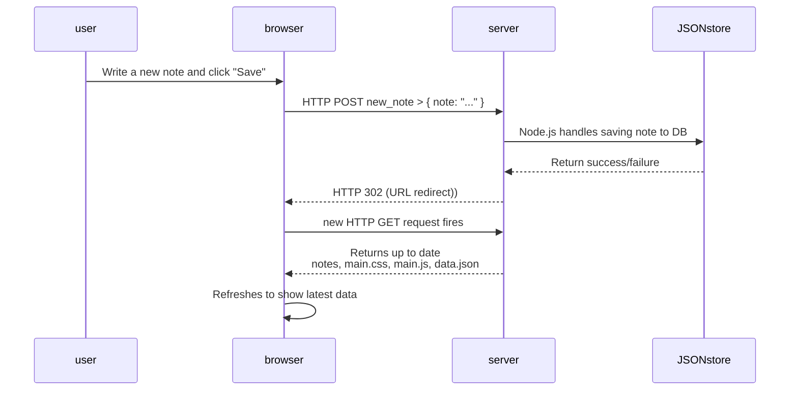

```mermaid
sequenceDiagram
participant user
participant browser
participant server
participant JSONstore

user->>browser: Write a new note and click "Save"
browser->>server: HTTP POST new_note > { note: "..." }
server->>JSONstore: Node.js handles saving note to DB
JSONstore-->>server: Return success/failure
server-->>browser: HTTP 302 (URL redirect))
browser->>server: new HTTP GET request fires
server-->>browser: Returns up to date <br> notes, main.css, main.js, data.json
browser->>browser: Refreshes to show latest data
```
