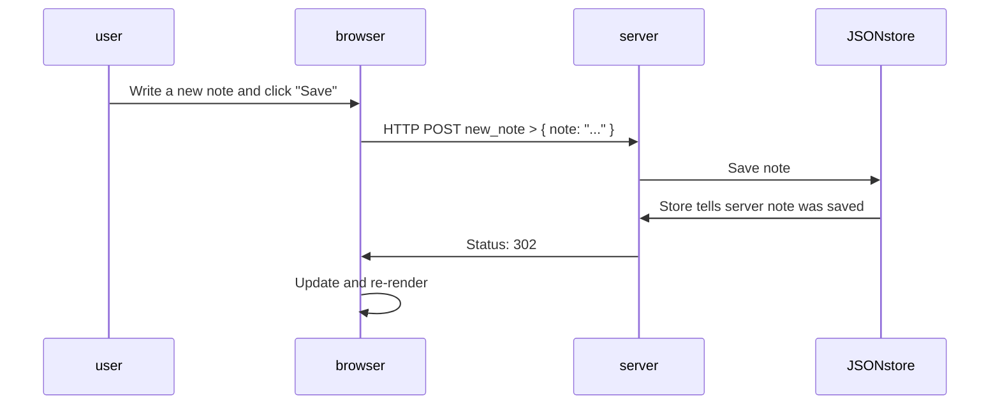

```mermaid
sequenceDiagram
participant user
participant browser
participant server
participant JSONstore

user->>browser: Write a new note and click "Save"
browser->>server: HTTP POST new_note > { note: "..." }
server->>JSONstore: Save note
JSONstore->>server: Store tells server note was saved
server->>browser: Status: 302
browser->>browser: Update and re-render
```
