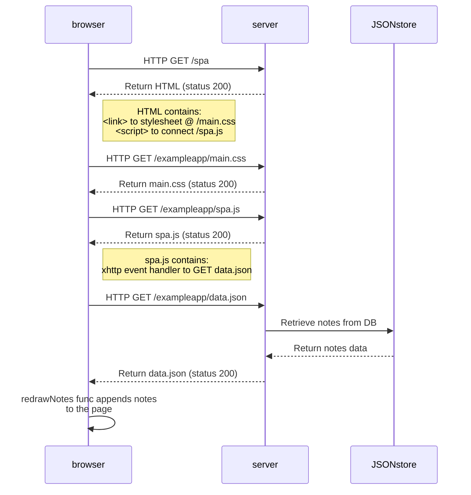

```mermaid
sequenceDiagram
participant browser
participant server
participant JSONstore

browser->>server: HTTP GET /spa
server-->>browser: Return HTML (status 200)
Note right of browser: HTML contains: <br> <link> to stylesheet @ /main.css <br> <script> to connect /spa.js
browser->>server: HTTP GET /exampleapp/main.css
server-->>browser: Return main.css (status 200)
browser->>server: HTTP GET /exampleapp/spa.js
server-->>browser: Return spa.js (status 200)
Note right of browser: spa.js contains: <br> xhttp event handler to GET data.json
browser->>server: HTTP GET /exampleapp/data.json
server->>JSONstore: Retrieve notes from DB
JSONstore-->>server: Return notes data
server-->>browser: Return data.json (status 200)
browser->>browser: redrawNotes func appends notes <br> to the page
```
