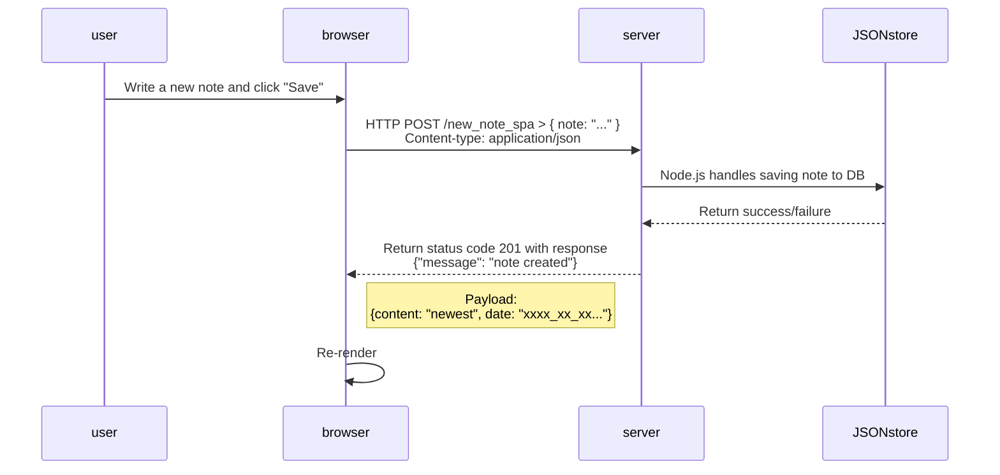

```mermaid
sequenceDiagram
participant user
participant browser
participant server
participant JSONstore


user->>browser: Write a new note and click "Save"
browser->>server: HTTP POST /new_note_spa > { note: "..." } <br> Content-type: application/json
server->>JSONstore: Node.js handles saving note to DB
JSONstore-->>server: Return success/failure
server-->>browser: Return status code 201 with response <br> {"message": "note created"}
Note right of browser: Payload: <br>{content: "newest", date: "xxxx_xx_xx..."}
browser->>browser: Re-render
```